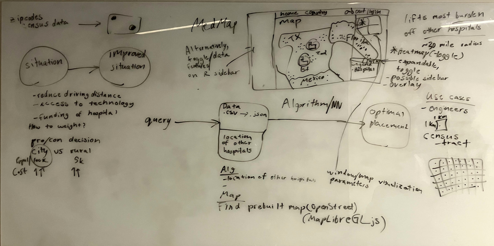

# MedMap

A hospital-placement recommendation tool built for **TigerHacks26**.

## What it does

MedMap recommends where a new hospital should be built. It combines:

- **Census population** by tract, to see where people live
- **HRSA shortage-area designations** (MUA/P and HPSA), to see where care is
  already scarce
- **CMS hospital locations**, to see how far people are from the nearest hospital
  and how much load each existing hospital carries

It ranks candidate sites on an interactive map. You set how much each factor
matters, such as driving distance, shortage status and pressure on nearby
hospitals, and the recommendations update to match.

## Why it matters

Millions of Americans, especially in rural areas, live a long drive from the
nearest hospital. In an emergency, that distance costs lives. Choosing a site
for a new hospital is a costly, long-term decision, and it often rests on
scattered data and guesswork. MedMap puts the relevant public data in one place
and shows the trade-offs, such as a dense city versus an underserved rural
area, so the decision can rest on evidence.

## Who it's for

- **Health-system planners and hospital developers** choosing where to expand
- **Public-health agencies and policymakers** deciding where to direct
  funding for underserved areas
- **Engineers and analysts** who need tract-level access and demand data

Results are planning evidence, not a replacement for detailed site, clinical,
regulatory or financial analysis.

## How we planned it

Our first whiteboard sketch: census and hospital data go into a ranking
algorithm that outputs optimal placements, shown on a MapLibre map with
toggleable layers and a heatmap.



For other deployment options, see [DEPLOYMENT.md](DEPLOYMENT.md).

## A. Run with Docker

From the repo root:

```bash
docker compose -f docker/docker-compose.yml up --build   # build and start
docker compose -f docker/docker-compose.yml down         # stop and remove the containers
```

The site is at **<http://localhost:8000/>**. The map is at `/map`.

## B. Share a public link with a Cloudflare tunnel

While MedMap is running on port 8000, run these in a second terminal:

```powershell
winget install --id Cloudflare.cloudflared         # install cloudflared (one time)
cloudflared --version                              # check that the install worked
cloudflared tunnel --url http://localhost:8000/    # open the tunnel
```

The last command prints a public `https://<random-words>.trycloudflare.com`
link that anyone can open. No Cloudflare account is needed. The link works only
while that terminal stays open. Press `Ctrl+C` to close the tunnel.
