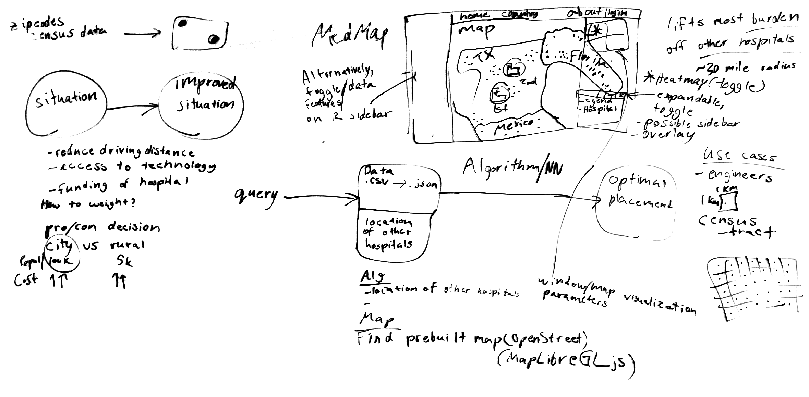

# Try it Now

## Live Cloudflare Link

link

# MedMap

**Where should the next hospital go, and what should it be?**

MedMap is a nationwide hospital-siting tool built for **TigerHacks26**. It
scores every populated census tract in the United States and recommends places
where a new hospital would help the most people reach care. For each site it
also suggests the right size of hospital and the departments it should offer.
You explore the results on an interactive map and choose which trade-offs
matter most.



*Our first whiteboard sketch: public data goes into a ranking algorithm, and
the best placements are shown on a MapLibre map.*

## Contents

- [Why it matters](#why-it-matters)
- [Who it's for](#who-its-for)
- [What makes it interesting](#what-makes-it-interesting)
- [How it works](#how-it-works)
- [Installation](#installation)
  - [A. Run with Docker](#a-run-with-docker)
  - [B. Share a public link with a Cloudflare tunnel](#b-share-a-public-link-with-a-cloudflare-tunnel)

## Why it matters

Many Americans, especially in rural areas, live a long drive from the nearest
hospital, and in an emergency that distance costs lives. A new hospital costs
hundreds of millions of dollars and stays in place for decades. Yet the
evidence needed to choose a site is spread across a dozen federal datasets in
different formats and geographies.

MedMap brings that evidence together. It doesn't just count people. It asks:

> **If we built a hospital here, how many people would newly reach care within
> 30 minutes, and how much would it relieve the hospitals already nearby?**

## Who it's for

- **Health-system planners and hospital developers** choosing where to expand,
  and at what size
- **Public-health agencies and policymakers** deciding where to direct funding
  for underserved communities
- **Analysts and researchers** who need tract-level data on access, demand and
  vulnerability

## What makes it interesting

### It covers the whole country

The pipeline starts from **84,415 census tracts** and **168,598 CMS facility
records**, of which **11,859 hospitals** are geocoded to exact coordinates. It
then evaluates **34,319 candidate sites** in every state.

### It models drive time, not straight lines

Driving 20 miles in Chicago isn't the same as driving 20 miles in rural
Montana. MedMap estimates drive time from each candidate to every nearby tract
using a travel model adjusted for how rural the area is. Roads wind more in
rural areas (a detour factor of 1.34 versus 1.20 in cities) but traffic moves
faster (52 mph versus 29 mph). The rurality comes from USDA RUCA codes.
Spatial KD-trees on a unit sphere make the nationwide calculation take minutes
instead of days of full road routing.

For each site it measures:

- the **people who would newly be within 15, 30, 45 and 60 minutes** of a
  hospital
- the **total drive minutes saved**, weighted by population
- how many **older, low-income, uninsured and disabled** residents fall inside
  each drive-time band

### It chooses what to build, not just where

Every site is tested against **five hospital designs**, from a 25-bed rural
hospital to a 300-bed regional center, which makes **171,595 site-and-design
combinations**. Each combination is scored on:

| Factor | What it measures |
|---|---|
| People helped | Newly reachable population and drive minutes saved |
| Remoteness | How far the area is from any hospital today |
| Bed shortage | Unmet beds against a 2.5 beds per 1,000 people benchmark, after counting the beds already within 30 minutes |
| Community need | Older adults, poverty, lack of insurance, disability and households without a car across the catchment area |
| Service demand | Need for specific departments (see below) |
| Right size | Whether the local market can support that design, with a penalty for oversized hospitals |
| Value for cost | Access benefit per million dollars of estimated construction cost |

MedMap also computes the **Pareto frontier**: the **210 sites** that no other
site beats on every factor at once. These are the strongest trade-offs,
whatever weights you prefer.

### It recommends departments

For each site, MedMap scores need for **11 service lines**: emergency, ICU,
general surgery, maternity, cardiology, stroke, behavioral health, pediatrics,
advanced imaging, oncology and dialysis. The scores come from local
demographics. For example, cardiology and ICU need rise with the share of older
residents, and pediatrics and maternity rise with the share of children. When
a site needs a service its recommended design doesn't include, MedMap flags it
as a **service gap**.

### You can reweight it live

All of the heavy analysis is done ahead of time. The live app loads the
results into **DuckDB** behind **FastAPI** and re-ranks all 34,319 sites on
every request, so moving a weight slider or choosing a preset updates the map
right away. The presets are "Most people", "Remote areas", "High-need
communities" and "Best value".

Results also adapt to the map view. A **spatial-diversity filter** keeps the
recommendations spread out: at most one per tract, with a minimum spacing that
depends on how far you're zoomed in. That spacing relaxes step by step, so a
zoomed-out national view shows about 50 well-separated sites and a county view
fills in with hundreds.

### Its results are reproducible

The ETL runs in eight staged steps. Each run is fingerprinted by its inputs,
parameters and source code, so repeat runs reuse finished work. Raw downloads
are checked against SHA-256 receipts, and nationwide runs stop automatically if
a stage produces suspiciously few results. Each run also records its modeling
assumptions and whether its drive times are modeled or routed.

## How it works

```text
9 public datasets ─► Stage 1-2  clean and standardize (Parquet, raw values kept as strings)
                  ─► Stage 3    geocode hospitals, join to 2023 Census tract/county shapes,
                                overlay HRSA shortage areas
                  ─► Stage 4    add ACS demographics (age, poverty, income, insurance,
                                vehicles, disability)
                  ─► Stage 5    tract features: nearest hospital, nearby beds, need,
                                HRSA shortage-area coverage, rurality
                  ─► Stage 6    screen tracts, place candidates, model drive-time access
                  ─► Stage 7    test 5 hospital designs per site, cost-efficiency, Pareto frontier
                  ─► Stage 8    service-line recommendations, 15/30/45/60-min access bands
                  ─► DuckDB + FastAPI ─► React + MapLibre GL JS map
```

**Data sources:** CMS Hospital General Information and provider files, HRSA
Area Health Resources Files, HRSA Health Professional Shortage Areas (HPSA),
HRSA Medically Underserved Areas and Populations (MUA/P), CDC PLACES, CDC/ATSDR
Social Vulnerability Index, Census ACS 5-year estimates, USDA Rural-Urban
Commuting Area codes, and Census TIGER/Line boundaries.

**Stack:** Python (pandas, NumPy, SciPy, GeoPandas), Parquet, DuckDB, FastAPI,
React, Vite and MapLibre GL JS, packaged as one Docker image.

**Limitations:** drive times are modeled, not routed on actual roads. The bed
benchmark, hospital designs and construction costs are planning estimates for
comparing sites, not financial forecasts or clinical standards. The pipeline
marks its strongest sites for exact road routing as a future step.

For local development and other deployment options, see
[DEPLOYMENT.md](DEPLOYMENT.md).

## Installation

### A. Run with Docker

From the repo root:

```bash
docker compose -f docker/docker-compose.yml up --build   # build and start
docker compose -f docker/docker-compose.yml down         # stop and remove the containers
```

The site is at **<http://localhost:8000/>**. The map is at `/map`.

### B. Share a public link with a Cloudflare tunnel

While MedMap is running on port 8000, run these in a second terminal:

```powershell
winget install --id Cloudflare.cloudflared         # install cloudflared (one time)
cloudflared --version                              # check that the install worked
cloudflared tunnel --url http://localhost:8000/    # open the tunnel
```

The last command prints a public `https://<random-words>.trycloudflare.com`
link that anyone can open. No Cloudflare account is needed. The link works only
while that terminal stays open. Press `Ctrl+C` to close the tunnel.